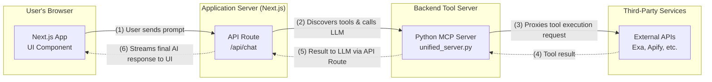

---

# Inttrest: AI-Powered Location Discovery Map

[](https://opensource.org/licenses/MIT)

Inttrest is an interactive, interest-based location discovery application. It combines a beautiful 3D map interface with a powerful AI chat assistant that can use external tools to find and display points of interest in real-time.


*(A screenshot of the application would go here)*

## ✨ Features

- **🤖 AI-Powered Chat:** Converse with an intelligent assistant to find restaurants, parks, museums, and more.
- **🛠️ Dynamic Tool Use:** The AI leverages the **Model Context Protocol (MCP)** to dynamically use external APIs for web scraping (Apify) and advanced search (Exa).
- **🗺️ Interactive 3D Map:** Explore locations on a stunning 3D map powered by Mapbox, complete with terrain visualization.
- **⚡ Unified Tool Backend:** A central Python server aggregates multiple MCP-compatible tools, providing a single, consistent endpoint for the AI.
- **🚀 Modern Frontend:** Built with the latest web technologies, including Next.js 15, React 19, and Tailwind CSS, all optimized with Turbopack.
- **🔌 Extensible Architecture:** Easily add new data sources and tools to the MCP server to expand the assistant's capabilities.

## 🏗️ Architecture

The application follows a client-server architecture where the frontend communicates with a backend tool server via an API route. The AI model acts as a reasoning engine, deciding when to call external tools to fulfill a user's request.



**Flow Explanation:**
1.  A user sends a message from the **Next.js Frontend**.
2.  The request hits the `/api/chat` route, which connects to the local **Python MCP Server** to discover available tools (e.g., `exa.search`).
3.  The prompt and the list of tools are sent to an **OpenAI model**.
4.  If the model decides to use a tool, the AI SDK executes it by calling the Python MCP Server, which **proxies the request** to the appropriate external API (like Exa or Apify).
5.  The tool result is sent back to the model, which formulates a final answer.
6.  The response is streamed back to the user interface, and any discovered location data is used to update the map.

## 🛠️ Tech Stack

**Frontend:**
- **Framework:** [Next.js](https://nextjs.org/) 15 (with App Router & Turbopack)
- **Library:** [React](https://react.dev/) 19
- **AI Integration:** [Vercel AI SDK](https://sdk.vercel.ai/)
- **Mapping:** [Mapbox GL JS](https://www.mapbox.com/mapbox-gl-js) & [React Map GL](https://visgl.github.io/react-map-gl/)
- **Styling:** [Tailwind CSS](https://tailwindcss.com/)
- **Language:** [TypeScript](https://www.typescriptlang.org/)

**Backend (MCP Server):**
- **Framework:** [FastMCP](https://github.com/a-r-j/fastmcp)
- **Language:** [Python](https://www.python.org/) 3.12
- **Tool Providers:**
  - [Exa.ai](https://exa.ai/) (via MCP)
  - [Apify](https://apify.com/) (via MCP)

## 🚀 Getting Started

Follow these instructions to get the project running on your local machine.

### Prerequisites

- [Node.js](https://nodejs.org/) (v18 or later)
- [Python](https://www.python.org/downloads/) (v3.12, as specified in `.python-version`)
- `npm` or a compatible package manager
- API keys for:
  - OpenAI
  - Mapbox
  - Apify
  - Exa

### 1. Clone the Repository

```bash
git clone https://github.com/your-username/inttrest.git
cd inttrest
```

### 2. Set Up the Backend (MCP Server)

The unified server runs on `http://127.0.0.1:8000` and provides tools to the frontend.

```bash
# Navigate to the mcp_servers directory
cd mcp_servers

# Create and activate a Python virtual environment
python3 -m venv .venv
source .venv/bin/activate
# On Windows, use: .venv\Scripts\activate

# Install Python dependencies
pip install -r ../requirements.txt

# Create an environment file (if you don't have one)
touch .env
```

Now, add your API keys to the `.env` file:

**`mcp_servers/.env`**
```
APIFY_API_TOKEN="your_apify_api_token"
EXA_API_KEY="your_exa_api_key"
```

Finally, start the server in a dedicated terminal window:

```bash
python unified_server.py
```
You should see output indicating the server has started successfully.

### 3. Set Up the Frontend

Open a new terminal window for these steps.

```bash
# Navigate to the frontend directory from the project root
cd frontend

# Install Node.js dependencies
npm install

# Create a local environment file
touch .env.local
```

Now, add your API keys to the `.env.local` file:

**`frontend/.env.local`**
```
# Get this from your Mapbox account
NEXT_PUBLIC_MAPBOX_ACCESS_TOKEN="pk.your_mapbox_public_access_token"

# Get this from your OpenAI account
OPENAI_API_KEY="sk-your_openai_api_key"

# Optional: Specify a different OpenAI model
# OPENAI_MODEL="gpt-4o"
```

### 4. Run the Application

With the backend server still running in the first terminal, start the frontend development server:

```bash
npm run dev
```

Your application should now be running at [http://localhost:3000](http://localhost:3000).

## 📜 License

This project is licensed under the MIT License. See the [LICENSE](LICENSE) file for details.

